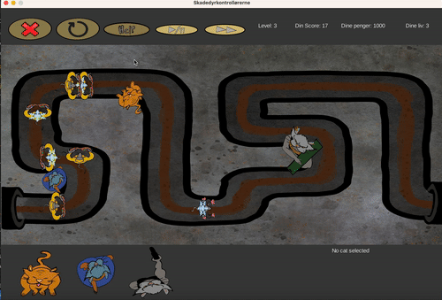
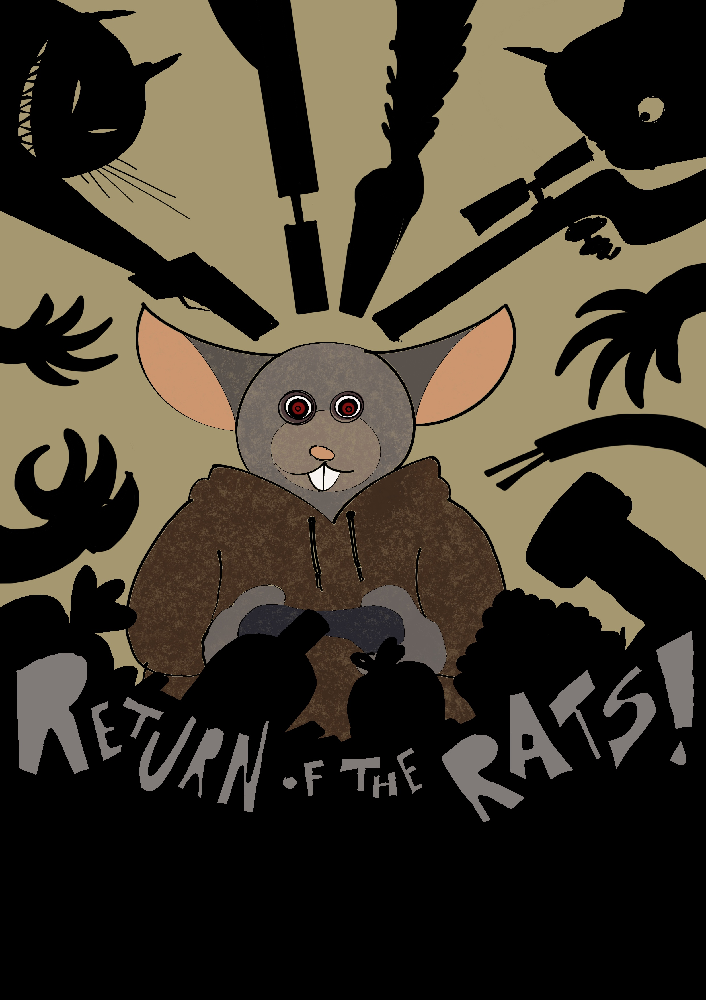
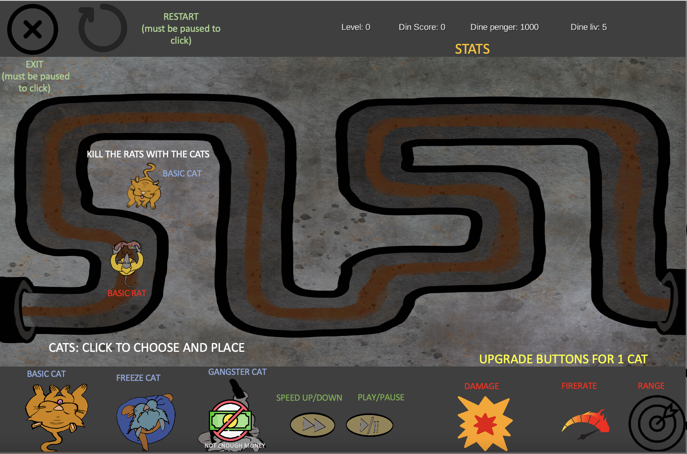

# INF112 Project - *Skadedyrkontrollørene INC, Return of the Rats*

* Team: *Skadedyrkontrollørene_inc* (Gruppe 1): 
    * *Jonathan Christensen - Developer/Git*
    * *Axel Lundeby - Developer/Grafikk*
    * *Theodor Nissen-Meyer - Lead Developer*
    * *Jacob Foss - Developer/Testansvarlig* 

### Om spillet
I dette strategispillet er målet å forsvare byen mot en invasjon av rotter ved hjelp av ulike typer katter plassert langs rottens invasjonsrute. Spillet foregår i en todimensjonal verden, nede i kloakken, hvor spillere kan utplassere kattene rundt røret som rottene kryper i.

#### Gameplay 

#### Game Start Screen

#### Help Screen

### Last ned spillet herifra
[click me to download](skadedyrkontrollorene-inc.jar)

### Hvordan spille spillet
Når man starter spillet blir man møtt av en forside. Her k/Users/axellundeby/Desktop/INF112/skadedyrkontrolloererne_inc/skadedyrkontrollorene-inc.jaran man enten åpne hjelpe-menyen ved å trykke på "help", eller gå rett til spillmodus ved å trykke på "Play". Etter man har trykket på play kan man plassere ut katter. Det gjør man ved å trykke på den katten man vil velge, og deretter trykke på kartet. Videre trykker man på "play/pause"-knappen for å starte spillet. Da vil rottene komme, og hvis man synes at det går for sakte kan man trykke på "fast-forward"-knappen. Den finner man ved siden av play/pause. Når rottene er drept er runden over. For å oppgradere kattene kan man trykke på en av kattene man har stående ute på kartet, og deretter trykke på et av de tre ikonene som ligger langs bunnlinjen på høyre side. Disse oppgraderer firerate, range og damage. Øverst til høyre på skjermen ser man oversikt over statestikken sin. Trenger man hjelp kan man trykke på "hjelp"-knappen. Da får man se hjelpemenyen, og kan fortsette spillet igjen når man har sett ferdig. Hvis man vil starte på nytt kan man trykke på "restart"-knappen, og hvis man vil avslutte trykker man på "x"-knappen.

### Kjøring
* Kompileres med `mvn package`.
* Kjøres med `java -jar target/returnOfTheRats-1.0-SNAPSHOT-fat.jar`
* Krever Java 21 eller senere

### Credits
Fabian Christensen - Grafikk